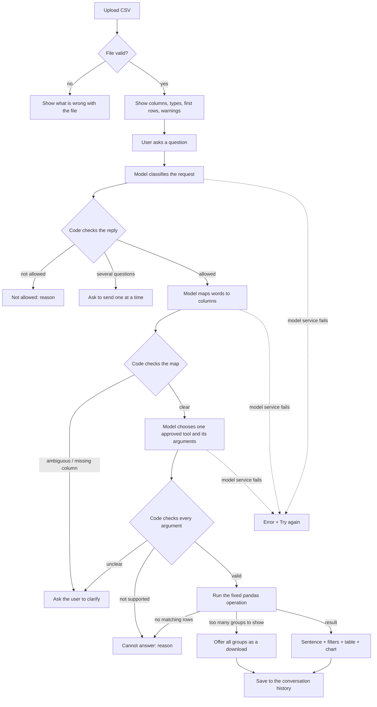

# PROJECT PALN - AI DATA ANALYST SYSTEM

## 1. project name and problem

**AI Data Analyst**: A web app that answers questions in plain english about a CSV file.

**Problem**: A business user has a CSV file but cannot write Pandas queries, so it takes him a long time to make analysis expecially for repetitive requests.

**Realistic example**: A sales maneger has a daily stand-up meeting and needs to check the previous day's sales before the meeting, she would need to send the requests along with the file to the data analyst and waiting for a reply, or she will write the pandas query herself with her narrow programming background. Using this system she will be able to only upload the file and get the analysis of her request during a short time. 

---

## 2. Target user and goal

**User**: A business user (sales, operations,management) with a CSV file but cannot write Pandas queries (no programming experience).

**Goal**: In one visit, upload a CSV file, check that it loaded correctly, ask few questions in plain language, and give reliable answers ( a sentence, a number, a small table, a chart when needed, and the filters applied).

---

## 3. Scope

**The system WILL**
1. Load a CSV file, check it is valid, and show its columns, types and display the first rows.
2. Answer counts, totals, averages, medians, means, max and min values.
3. Grouped comparisons (a total or average for each group) and rankings of groups (top or bottom N).
4. Group or filter by parts of a date (year, quartar, month, weekday, weekend).
5. Show a few rows that match a condition.
6. List the different values in a column (which payment methods appear in the file).
7. Ask the user to clarify when a question is ambiguous or names a column that does not exixt.  


**The system WILL NOT**
1. Change, delete, or add data.
2. Export or download the whole file.
3. Run complex statistics beyond simple summaries (correlation, growth rates, forecasting).
4. Compute new values form existing columns(revenue - cost).
5. Answer several quesions in one request.


**Example request outside scope:** "What is the correlation between price and rating?" The system replies that this type of analysis is not supported and lists what it can do.

---

## 4. Input contract 

### 4.1 User inputs

| Input | Required | Type | Example | If missing or invalid |
|---|---|---|---|---|
| CSV file | Yes | `.csv` | `amazon_sales_sample.csv` | missing: "Upload a CSV file in the sidebar to start." |
| | | | | Not `.csv`: "Please upload a .csv file." |
| | | | | Empty file: "The file is empty." |
| | | | | Header only: "The file has column names but no rows." |
| | | | | Fewer than 30 rows: "The file has only N rows. At least 30 are needed." |
| | | | | Repeated column names: "These column names are repeated: [...]" |
| | | | | One column only: "Only one column was found. The file may use ';' instead of ','." |
| | | | | More than half the cells empty, or more than half the rows duplicated: rejected, with the share found |
| Question | Yes | Free text| `Total revenue by region` | missing: the question box does not send |
| | | | | Ambiguous: the user is asked to choose (see section 7) |
| | | | | Names a column that does not exist: "'city' has no usable column. Available columns: ..." |
| | | | | Out of scope: "Not allowed: ..." with the reason |


### 4.2 Columns of the sample dataset

| Column | Required | Type | Example | If missing or invalid |
|---|---|---|---|---|
| order_id | Yes | ID | 1005 | Empty: the row is kept and used for other questions |
| product_id | Yes | ID | 4838 | Same as order_id |
| product_category | Yes | Text | Electronics | Empty: the row is left out of the category groups |
| customer_region | Yes | Text | Europe | Same as product_category |
| payment_method | Yes | Text | UPI | Same as product_category |
| order_date | Yes | Date | 2023-04-05 | Empty: the row is left out of date questions. Unreadable dates: the column is treated as text, and date questions are refused |
| price | Yes | Number | 380.62 | Empty: skipped in sums and averages. Text instead of a number: the column is treated as text, and sums and averages are refused |
| discount_percent | Yes | Number | 10 | Same as price |
| quantity_sold | Yes | Number | 3 | Same as price |
| rating | Yes | Number | 3.9 | Same as price |
| review_count | Yes | Number | 260 | Same as price |
| discounted_price | Yes | Number | 342.56 | Same as price |
| total_revenue | Yes | Number | 1027.68 | Same as price |

### 4.3 Rules for any uploaded file

| Situation | What happens |
|---|---|
| Text that holds numbers ("1,234", "$12.50", "15%") | Converted to numbers |
| Text that hlods dates in one format | Converted to dates |
| Codes with leading zeros ("00123") | Kept as text |
| "N/A", "null", "-" and similar | Treated as missing |
| A missing value in a row | The row is kept, sums and averages ignore the missing value |
| A column more than 20% empty | File accepted, with a warning that names the column |
| More than 5% of the rows are exact duplicates | File accepted, with a warning |
| More than half of all cells in the file are empty | File rejected |
| More than half of the rows are exact duplicates | File rejected |

---

## 5. Output contract

For every question, the user exactly sees on of these:

| Outcome | What is shown |
|---|---|
| **Answer** | A sentence in plain language, the filters used, the result (one number or a small table), a chart for grouped or ranked results, and a "Download as CSV" button for tables |
| **Clarification** | A yellow message that says what is unclear and lists the choices |
| **Refusal** | A red message: "Not allowed: ..." with the reason |
| **Cannot answer** | A red message that says why (not supported, no matching rows, too many groups) |

**Example output**: Total revenue by region in 2023

> Q: Total revenue by region in 2023
>
> A: The middle east had the highest total  revenue at  4,210,500.00, while Europe had the lowest at 3,980,120.50.
>
> Filters used:  order_date (year) == 2023
>
> | Customer region | Total revenue |
> |---|---|
> | Asia | 4,105,300.20 |
> | Europe | 3,980,120.50 |
> | Middle East | 4,210,500.00 |
> | North America | 4,150,870.75 |

> [Bar chart]
> [Download as CSV]

---

## 6. Workflow



## 7. Agent specification 


**Goal**: Answer a user's plain question into one approved analysis on the file uploaded, or ask the user when the quedtion is not clear enough.

**Design**: The model does Not write python code itself, instead it chooses one tool from a predefined list and fills the arguments. The code checks every argument rhen runs the pandas code written.
(nothing the model writes is executed).


### 7.1 Available actions 

| Action | What it does |
|---|---|
| `classify_request` | Decide whether the request is allowed |
| `run_analysis` | Map words to columns, choose a tool, check it, run it |
| `answer_user` | Write the sentence and prepare the result for display |
| `reject_request` | Stop with the reason |
| `finish` | End the run |

### 7.2 Tools and permissions

The model may choose only one of these tools:

| Tool | Arguments | Example question |
|---|---|---|
| `count_rows` | filters | How many orders were paid with UPI? |
| `aggregate` | column, agg, filters | Average rating for Electronics |
| `group` | group_by, column, agg, date_part, filters | Total revenue by region |
| `top_n` | group_by, column, agg, n, order, filters | Top 3 categories by revenue |
| `distinct` | column, filters | Which payment methods are there? |
| `show_rows` | filters, sort_by, order, limit | Show the 5 most recent orders from Europe |

Every argument is checked in code before the tool runs:

- No tool can change, delete, or export data.
- The model cannot use a column the user did not mention.


### 7.3 State variables

| Variable | Meaning |
|---|---|
| `request_classified`| Has the request been judged|
| `authorized`| Is the reuqest allowed |
| `question_to_run` | The only text that reaches the analysis |
| `denied_parts` | Parts that were refused|
| `column_map` | Which column each word of the question refers to |
| `tool_call` | The tool and arguments chosen |
| `analysis_done`, `result` | Whether the tool ran, and its result |
| `answered`, `answer_text`, `filters_text` | The final answer shown to the user |
| `stop_type`, `rejection_reason` | Why the run stopped if it did |
| `history` | The steps taken in order |

The state also keeps a few fields used only for tracking and debugging,they do not affect any decision.


### 7.4 Decision rules

The next action is decided by code from the state, never by the model:
1. Not classified yet → `classify_request`
2. Not allowed → `reject_request`
3. Not analysed yet → `run_analysis`
4. Not answered yet → `answer_user`
5. Otherwise → `finish`

### 7.5 When the agent asks the user

| Situation | Example | What is asked |
|---|---|---|
| A word could mean several columns | A word that fits more than one column equally well | Which column is meant, listing the columns || No measure is named | "Which category is the best?" | What to measure: revenue, rating, quantity, or number of records |
| A column does not exist | "Total revenue by city" | Shows the available columns |
| A value does not exist | "What is the average rating for Toys?" | Asks the user to clarify instead of giving a number |
| Several questions at once | "Total revenue and number of orders" | Ask them one at a time |

### 7.6 When the agent stops

- The request is out of scope (export, change the data, run commands) → refused.
- The analysis is not supported, no rows match, or there are too many groups → "Cannot answer" with the reason.
- The model service fails → error with "Try again".
- Safety limit: the run stops after 10 steps.

---

## 8. Data preperation 

**Data used**: A public Amazon sales dataset, A sample of the first **2000 rows** is kept in the project (`data/amazon_sales_sample.csv`)Instructions for downloading the full file are in the README.

**Columns and types:** see section 4.2

**Possible missing values:** empty cells, "N/A" or "null" or similar, dates in an unexpected format.

**How the data will be checked when loaded:**
1. File type, empty file, header only file, fewer than 30 rows.
2. Repeated column names, and a single column.
3. Types: numbers and dates stored as text are converted when every value converts.
4. Share of empty cells and duplicate rows: warning above 20% / 5%, rejection above 50%.


## 9. Interface sketch


```
┌──────────────────────────┬──────────────────────────────────────────────────┐
│ SIDEBAR                  │ AI Data Analyst                                  │
│                          │ Short description + what can / cannot be asked   │
│ Data                     │                                                  │
│ [ Upload CSV file ]   (1)│ ▾ First five rows                           (4)  │
│ [ Use sample dataset ]   │   [ table of the first 5 rows ]                  │
│                          │                                                  │
│ file name                │ ┌──────────────────────────────────────────────┐ │
│ Rows: 2,000  Cols: 13(2) │ │ CONVERSATION                           (5)   │ │
│                          │ │ Try one of these: [q1] [q2] [q3] [q4]        │ │
│ warnings           (3)   │ |                                              │ │
│                          │ │ 👤 Total revenue by region                  │ │
│ Columns                  │ │ 🤖 ✓ Done                                   │ │
│ ┌──────────┬───────┐     │ │    Sentence answer                    (6)    │ │
│ │ column   │ type  │     │ │    Filters used: ...                         │ │
│ │ order_id │ ID    │     │ │    [ result table ]                          │ │
│ │ ...      │ ...   │     │ │    [ bar / line chart, labelled axes ] (7)   │ │
│ └──────────┴───────┘     │ │    [ Download as CSV ]                       │ │
│                          │ │    ▸ How the agent decided                   │ │
│ [ Clear answers ]        │ │                                              │ │
│                          │ │ 👤 Which category is the best?               │ │
│                          │ │ 🤖 ⚠ What do you want to measure? ...  (8)  │ │
│                          │ └──────────────────────────────────────────────┘ │
│                          │ [ Ask a question about this data ]  [Send ➤] (9)│
└──────────────────────────┴──────────────────────────────────────────────────┘

```


1. CSV upload 
2. file summary 
3. data quality warnings 
4. dataset preview 
5. conversation history, cleared when a new file is loaded 
6. result area 
7. chart for grouped results 
8. clarification or error message
9. question box and Send button.

---

## 10. Success tests 

### 10.1 Required test types

| ID | Type | Input / situation | Expected behaviour |
|---|---|---|---|
| T1 | Normal valid input | "Total revenue by region" | Table and bar chart, values equal a pandas groupby().sum() |
| T2 | Required field missing | No file uploaded, or an empty question | "Upload a CSV file in the sidebar to start.", an empty question is not sent |
| T3 | Ambiguous / incomplete request | "Which category is the best?" | Asks what to measure and lists the choices, no number is shown |
| T4 | Boundary or unsupported request | "Revenue by week of year" (52 weeks) | Refused: too many groups (limit 50), suggesting a higher-level grouping |
| T5 | Invalid file / tool error | Upload an empty CSV | "The file is empty.", nothing else runs |
| T6 | Out of scope | "Export the full table to CSV" | "Not allowed" with the reason |
| T7 | Missing column | "Total revenue by city" | "'city' has no usable column", with the available columns |
| T8 | No matching rows | "Total revenue in 2030" | "No records match the filters (...)" |


### 10.2 Five planned business questions

| Type | Question | Expected result | Independent check |
|---|---|---|---|
| Count | How many orders are there? | Number of rows | `len(df)` |
| Filter | How many orders were paid with UPI? | One count | `(df.payment_method == "UPI").sum()` |
| Average | What is the average rating for Electronics? | One number | `df[df.product_category == "Electronics"].rating.mean()` |
| Grouped comparison | Total revenue by region | Table + bar chart | `df.groupby("customer_region").total_revenue.sum()` |
| Top item | Top 3 categories by total revenue | 3 rows, highest first | `df.groupby("product_category").total_revenue.sum().nlargest(3)` |

### 10.3 Two unclear questions 

| Question | Why it is unclear | Expected clarification |
|---|---|---|
| Which category is the best? | "Best" does not say what to measure | "What do you want to measure? Please choose one: price, rating, quantity_sold, total_revenue, ..., number of records." |
| Which region performs worst? | "Performs" does not say what to measure | "What do you want to measure? Please choose one: ..." |


---


## 11. Technology plan

| Part | Known from Session 16 | To learn for this project | Documentation |
|---|---|---|---|
| Agent | State, choosing the next action from a fixed set (load, process, summarise, finish), turning a question into a pandas operation, handling ambiguity | Asking the model for a JSON tool call from a closed list, and checking every argument in code instead of running model-written code | https://github.com/openai/openai-python |
| Interface | — | Streamlit: `file_uploader`, `chat_input`, `chat_message`, `session_state`, `secrets` | https://docs.streamlit.io/get-started · https://docs.streamlit.io/develop/api-reference |
| Charts | — | Plotly Express bar and line charts with labelled axes | https://plotly.com/python/ |
| Testing | — | pytest: test functions with `assert`, `parametrize` for many cases, `fixture` to load the data once, `pytest.raises` for expected errors | https://docs.pytest.org/ |

**Where each part fits:**
- **Streamlit (`app.py`)** only displays: upload, preview, question box, answers, charts, and history. It holds no decision logic.
- **The agent (`agent/`)** decides: it classifies the request, maps words to columns, has the model choose a tool, checks it, and runs it.
- **The tests (`tests/`)** check the data layer and the tools on their own with pytest, before they are connected to the model or the interface.

---

## 12. Build order

**Minimum working version (must work before any extra):**
1. Load and check a CSV file, with a clear message for each invalid case.
2. The tools as fixed pandas functions, tested on their own against pandas.
3. The agent: classify, map columns, choose and check a tool, run it.
4. Clarification for ambiguous questions and missing columns.
5. Streamlit page: upload, preview, question box, answer with filters, and one chart.
6. Conversation history kept across reruns, cleared on a new file.
7. The five planned questions pass their pandas checks.

**Optional enhancements (only after the minimum version works):**
- Showing matching rows, and downloading all matching rows.
- Filters on parts of a date (month, weekday, weekend).
- Suggested questions built from the file's columns.
- Data quality warnings for empty and duplicated data.
- Progress steps while the agent works.
- "Try again" after a model service failure.